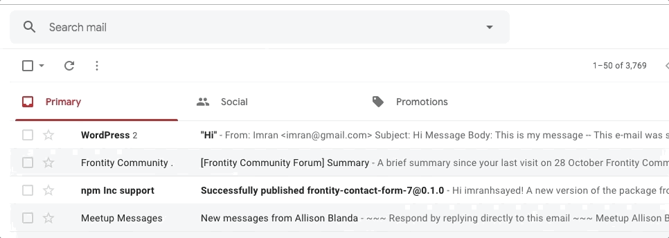
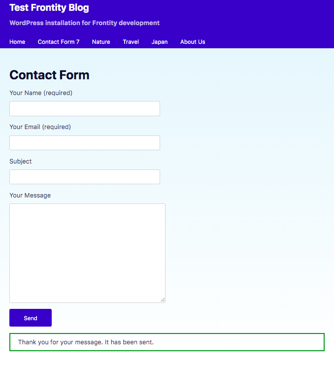

# Frontity Contact Form 7 :art:

:fire: Contact Form 7 extension for Frontity theme.

******* PLEASE STAR MY REPO TO SUPPORT OUR WORK 🙏 ******

Please follow me 🙏 on [twitter](https://twitter.com/imranhsayed) and github


# :video_camera: Demo CF7 Form


# :video_camera: Demo CF7 Form Email received


#### Below is the screentshot taken with Frontity mars theme with some added styles. The styles may look different for your Frontity theme. 


# How does it work?

> You need to create a page in your WordPress site ( if you don't already have one ) that contains the CF7 shortcode.
Install the package as shown in the Installation steps below.
>Then put that WordPress page name, the slug and the package name in the `frontity-settings.js` as explained below. The Frontity page will automatically render all the CF7
forms that are present on that page including the content of the page.
On successful form submission, the email goes to the admin ( if CF7 email settings are configured on your WordPress site  ). Errors are shown as well if the fields are invalid.

> It uses html processors to render the CF7 form.

# Features
1. All CF7 forms on the page will display
2. You can also use it for multiple pages.
3. Built with React Frontity in React, so its fast and performant.

# Installation :wrench:

### 1. For new project: by cloning this project.

1. `git clone https://github.com/imranhsayed/frontity-contact-form-7`
2. `cd frontity-contact-form-7`
3. `npm install && npx frontity dev` ( from the project's root directory )
 
4. Your site will now be available at `http://localhost:3000/`

## 2. For new/existing project using npm

> Please follow step 1 to 5 for new project and 2 to 5 for existing project.

1. `npx frontity create my-app && cd my-app`
2. `npm install frontity-contact-form-7` ( in the root of your project )
3. In the `frontity-settings.js`
a. Add the package name
```ruby
  "packages": [
    {
      "frontity-contact-form-7",
```
b. Add Contact form 7 page name and slug as what you have on your WordPress site. For example
```ruby
        "theme": {
          "menu": [
            [
              "Contact Form 7",
              "/cf7"
            ],
```
c. Update your WordPress API URI if not added already.
 ```ruby
      "state": {
        "source": {
          "api": "https://your-wordpress-site.com/wp-json"
        }
 ```
4. `npx frontity dev` ( from project's root directory )
5. Your site will be available at `http://localhost:3000/`

## More info :clipboard:

This is the beta version. Some features will be added in the final release, like:

1. More button smaller screens.

## Common Commands :computer:

- `npx frontity dev` ( inside project's root ) Runs server in development mode ( from the root of your project )

## Credits :white_flower:

- Build with love :blue_heart:, using [Frontity's](https://frontity.org)

## Author

1. [Imran Sayed](https://twitter.com/imranhsayed)
2. [Smit Patadiya](https://twitter.com/smit_patadiya)

## License :scroll:


- **[GPLv2](https://www.gnu.org/licenses/old-licenses/gpl-2.0.en.html)**
